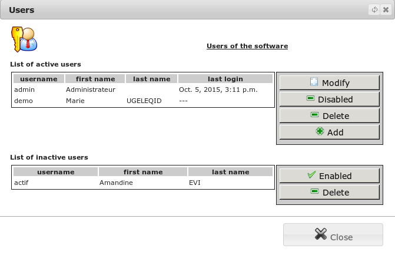
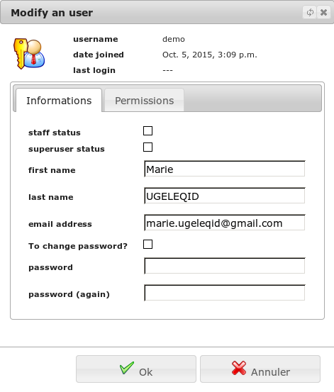
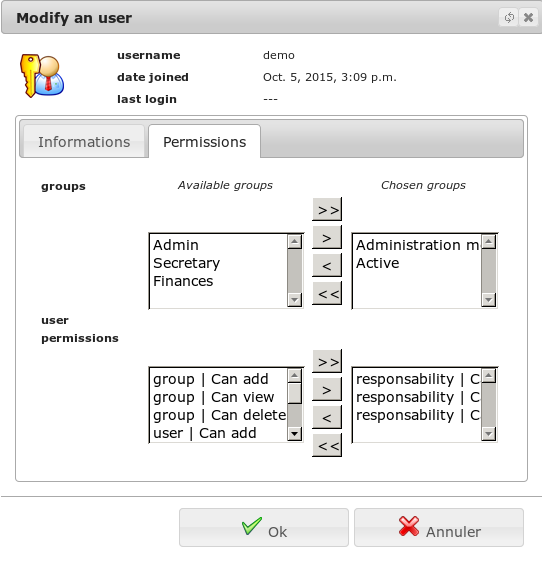

Users
=====

The `Management/Rights manage/Users` allows you to create, modify, 
or disable an application user. A user defines a connection right to the 
software.

On this list, you can create or edit the user: his alias, his name and 
his password. You can add groups and additional permissions to define the 
access level to the software. You can also disable a user for him prohibit 
access to the application.

