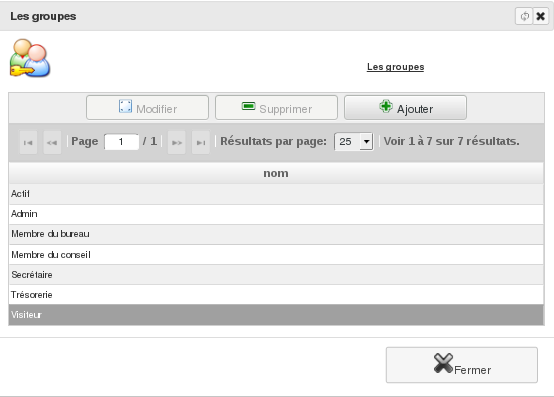

Les groupes
===========

     Menu *Administration/Gestion des Droits/Les groupes*
     
Créez, modifiez ou supprimez un groupe de droits.

Un groupe de droits permet de définir les autorisations (accès à certaines fonctionnalités du logiciel) qui sont consenties aux utilisateurs de l'application rattachés à celui-ci.

.. image:: _static/group_modify.png
