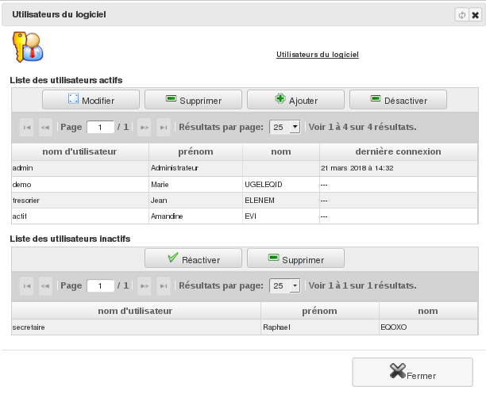
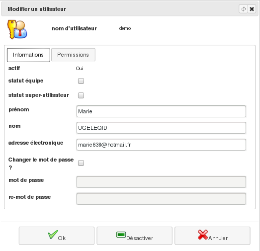
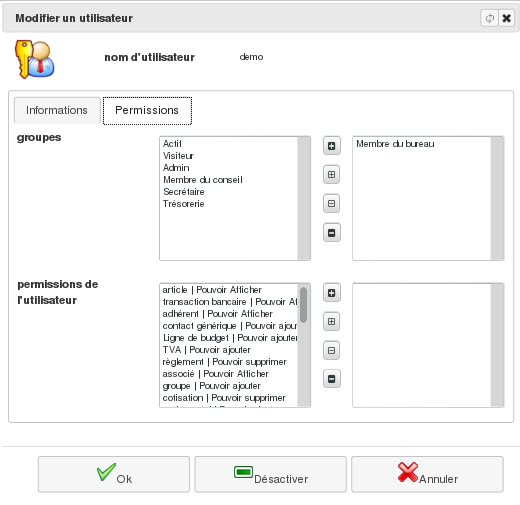

Les utilisateurs
================

Le menu `Administration/Gestion des Droits/Les utilisateurs` vous 
permet de créer, modifier ou désactiver un utilisateur de l'application. Un 
utilisateur définit un droit de connexion au logiciel.

Depuis cette liste, vous pouvez créer ou modifier l'utilisateur: son 
alias, son nom et son mot de passe. A cela, vous lui ajouter des groupes et 
des permissions suplémentaires éventuelles afin de définir son niveau 
d'accès au logiciel. Vous pouvez aussi désactiver un utilisateur pour lui 
interdire l'accès à l'application.

